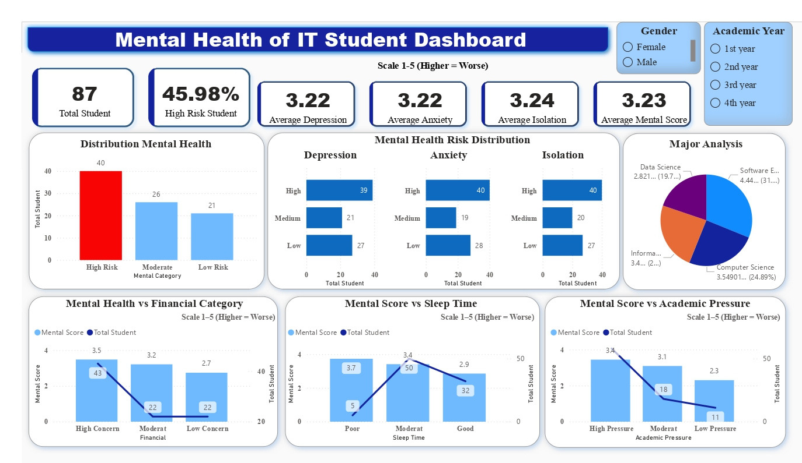

# Student Mental Health Analysis Dashboard

## 📌 Project Overview
This project analyzes student mental health conditions using SQL, PostgreSQL, Python, and Power BI.

The dashboard explores how academic pressure, financial concerns, sleep patterns, and other factors influence students’ mental health conditions.

The main objective of this project is to transform raw survey data into meaningful insights through data preprocessing, SQL analysis, and interactive dashboard visualization.

---

# 📊 Dashboard Preview



---

# 🚀 Tools & Technologies

- PostgreSQL
- SQL
- Python (Pandas, SQLAlchemy)
- Power BI
- Power Query

---

# 📁 Dataset Information

The dataset contains information related to:
- Student demographics
- Academic background
- Financial concerns
- Sleep habits
- Social relationships
- Depression, anxiety, and isolation scores

## Dataset Source

[Dataset Link]([https://www.kaggle.com/datasets/abdullahashfaqvirk/student-mental-health-survey/data])

---

# ⚙️ Project Workflow

```text
Raw CSV Dataset
        ↓
Data Cleaning & Preprocessing
        ↓
PostgreSQL Database
        ↓
SQL Analysis & KPI Calculation
        ↓
Power BI Dashboard Visualization
        ↓
Insight & Storytelling
```

---

# 🛠️ Data Preprocessing

Several preprocessing steps were performed before analysis:

- Fixed CSV import issues
- Converted incorrect data types
- Standardized categorical labels
- Checked missing values
- Checked duplicate records
- Created analytical categories
- Performed feature engineering

---

# 🧠 Feature Engineering

## Mental Score

```sql
(depression + anxiety + isolation) / 3
```

Scale:
- 1 = Lower Risk
- 5 = Higher Risk

---

## Mental Category

| Score Range | Category |
|---|---|
| 1.0 – 2.0 | Low Risk |
| 2.1 – 3.5 | Moderate |
| 3.6 – 5.0 | High Risk |

---

# 📈 Key KPIs

The dashboard includes several KPIs:

- Total Students
- High Risk Student Percentage
- Average Mental Score
- Average Depression Score
- Average Anxiety Score
- Average Isolation Score

---

# 📊 Dashboard Analysis

The dashboard analyzes:

- Mental health distribution
- Academic pressure vs mental score
- Financial concerns vs mental health
- Sleep patterns vs mental score
- Major analysis
- Depression, anxiety, and isolation distribution

---

# 🔍 Key Insights

- Nearly 46% of students fall into the high-risk mental health category.
- Students experiencing high academic pressure tend to have worse mental health conditions.
- Poor sleep patterns are associated with higher mental scores.
- Financial concerns contribute significantly to mental health risks.
- Anxiety and isolation appear to be dominant mental health indicators among students.

---

# ⚠️ Challenges During the Project

Several challenges were encountered during development:

- PostgreSQL CSV import issues
- Data type conversion problems
- Category sorting in Power BI
- Dashboard storytelling and layout optimization

These challenges improved my problem-solving and data preprocessing skills.

---

# 📂 Repository Structure

```text
student-mental-health-dashboard/
│
├── python/
│   └── postgreSQL_Python.py
│
├── dashboard/
│   ├── MentalHealth_Dashboard.jpg
│   └── Mental Health of IT Dashboard.pbix
│
└── README.md
```

---

# 📚 What I Learned

Through this project, I improved my skills in:

- SQL querying
- Data preprocessing
- PostgreSQL database management
- Power BI dashboard development
- KPI analysis
- Dashboard storytelling
- Insight generation

---

# 🎯 Final Thoughts

This project helped me understand how data analytics and visualization can transform raw survey data into actionable insights.

More importantly, this project strengthened my interest in data analytics, dashboard development, and storytelling with data.

---

# 👤 Author

Your Name

LinkedIn: [https://www.linkedin.com/in/destyarosa12/]  
GitHub: your-github-link

---

# ⭐ If you find this project interesting, feel free to give it a star!
